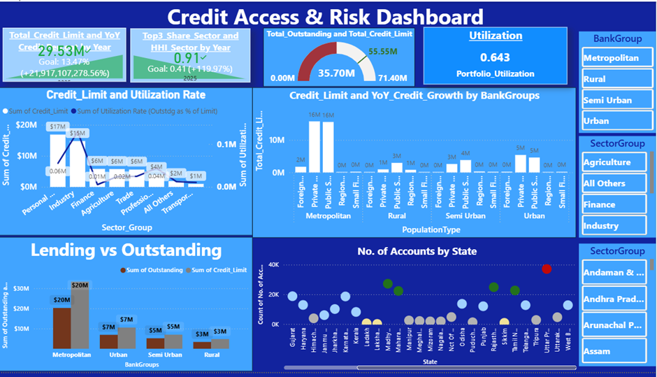

# Project Title

Bank Group Credit Dynamics: Regional, Sectoral, and Temporal Analysis.

## Description

Bank Group Credit Dynamics: Regional, Sectoral, and Temporal Analysis examines how credit extended by Scheduled Commercial Banks (SCBs) in India varies across bank groups, population segments (rural, urban, metropolitan), and credit sectors (agriculture, industry,finance, housing, personal) over time period of 2024 and 2025. 

## Getting Started

### Dependencies


* Windows 10, version 22H2
* PowerBI 
* Ecxel,Word, PDF.

### Installing

* No extra Installation required
  

### Methods used

```
* Excel and power query is used to clean and transform the raw dataset. 
* Intial dataset contains 10 years of data. 2 years of data is taken for this analysis.
*Analysis includes statistical, Diagnosis and Predictive.
*Pivot tables and Scenario managers are used for analysis.
*Power BI is used for visualization and Dashboard creation.



```

## Content

The Dataset is maintained by India Data Portal (ISP) and is provided by RBI(Primary source) captures information on the credit extended by scheduled commercial banks in India to various population groups, bank groups and occupation groups. 
```
source link: https://indiadataportal.com/p/reserve-bank-of-india/r/rbi-groupwise_credit_by_scbs-dt-yr-vvi 
```
* The repositary includes cleaned  excel dataset, clear analysis documentation.
and .pbix file.
## Version History

* 0.1
    * Initial version
